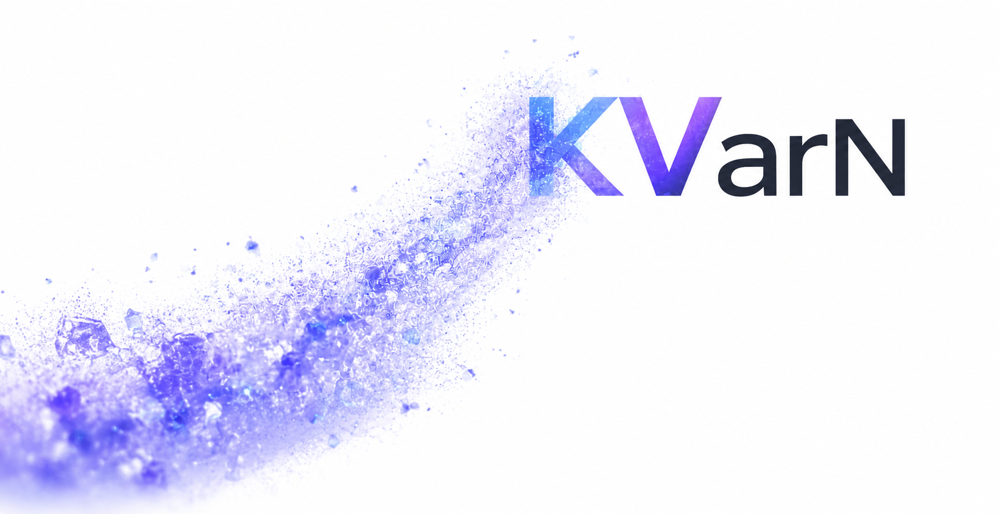

[](https://github.com/vllm-project/vllm)
[](https://opensource.org/licenses/Apache-2.0)
[](https://arxiv.org/abs/2606.03458)
[](https://huggingface.co/huawei-csl)
[](https://github.com/huawei-csl/KVarN/stargazers)


<p align="center">
  
</p>

> ⚡️ **Built for agentic and long-context workloads.**

> 💡 KVarN delivers **3-5x more KV-cache capacity** and **up to ~1.3x the throughput** of FP16, so you fit far longer contexts and serve more concurrent requests on the same GPU, with **FP16-level accuracy**.

> 🔌 **Calibration-free, plug-and-play with vLLM.** A native vLLM attention backend: add one flag, no model changes, no calibration.

---

## Why KVarN?

KV-cache quantization usually comes with a catch. As the
[vLLM TurboQuant blog](https://vllm.ai/blog/2026-05-11-turboquant) shows, existing
methods buy extra KV-cache capacity but **give up throughput** (TurboQuant reports
**40 to 52% lower throughput** for 2.3-3.7x capacity), and aggressive low-bit
quantization also tends to **cost accuracy**. Losing both speed *and* quality is
the main reason KV-cache quantization is rarely turned on in production.

**KVarN is built to keep both.** On Qwen3-32B (AIME25, 16K-context burst, TP=2) it
matches FP16 accuracy and **beats its throughput** while delivering ~4× the KV-cache capacity:

<p align="center">
  
</p>

KVarN stays in the upper-right corner the blog's methods can't reach: **FP16-level
accuracy, FP16-or-better throughput, and several times the context.**

---

## Quickstart

KVarN ships as a vLLM fork. Install it like vLLM, then select the KVarN KV-cache dtype.

```bash
# 1. Clone
git clone https://github.com/huawei-csl/KVarN.git
cd KVarN

# 2. Install (uses the upstream precompiled wheel; KVarN kernels are Triton, JIT-compiled at runtime)
VLLM_USE_PRECOMPILED=1 pip install -e .
```

```python
from vllm import LLM, SamplingParams

llm = LLM(
    model="Qwen/Qwen3-32B",
    dtype="float16",                    # KVarN runs in float16
    kv_cache_dtype="kvarn_k4v2_g128",   # enable KVarN
    block_size=128,                     # KVarN tile size
)
print(llm.generate("Explain KV-cache quantization in one sentence.",
                    SamplingParams(max_tokens=64))[0].outputs[0].text)
```

Serving works the same way:

```bash
vllm serve Qwen/Qwen3-32B --dtype float16 --kv-cache-dtype kvarn_k4v2_g128 --block-size 128
```

> **Note:** KVarN runs in `float16` compute. The tile / page size is currently
> fixed at 128 (one vLLM block = one KVarN tile); other page sizes are coming soon.

---

## How does KVarN work?

<p align="center">
  
</p>

KVarN quantizes the KV cache one fixed-size token tile at a time, walking each tile
through the four stages above:

1. **Cache**: the raw fp16 KV tile (channels × tokens), straight from attention.

2. **Rotated Cache**: a **Hadamard rotation** along the channel dimension mixes
   channels so that per-channel outliers are spread out, making the tile easier to
   quantize. The rotation is orthonormal, so attention scores are preserved.

3. **Normalized Cache**: **iterative variance normalization** (Sinkhorn-like)
   alternates column- and row-wise standard-deviation normalization in log space,
   equalizing variance across the tile and shrinking quantization error before any
   rounding happens.

4. **Quantized Cache**: **asymmetric round-to-nearest** at low bit-width, with the
   scales folded back in at read time (keys per channel, values per token).

The shipped preset spends **more bits on keys than values** (`kvarn_k4v2_g128`:
4-bit keys, 2-bit values). We chose to release this configuration because it meets
the strictest accuracy bar, matching FP16, that the most demanding production
deployments and vLLM require, while still delivering throughput above FP16. The
bit-widths are fully parameterized internally, so other presets are easy to add.

---

## Citation

KVarN is the official vLLM implementation of our paper, which describes the method
and the full set of benchmarks.

> 📄 **Paper:** [arXiv:2606.03458](https://arxiv.org/abs/2606.03458)

---

## License and attribution

KVarN is built on [vLLM](https://github.com/vllm-project/vllm) (v0.22.0) and is
released under the Apache 2.0 License. The original vLLM README is preserved as
[`README_vLLM.md`](README_vLLM.md).
